# kamuicode-workflow: AI-Powered Video Generation Workflows

🎬 **モジュール化されたAI動画生成システム** - GitHub Actionsで完全自動化された動画制作パイプライン

## 🌟 概要

kamuicode-workflowは、Kamui Codeを活用したClaude Code SDK & Gemini CLI ActionのAIエージェントによるGithub actionのクリエイティブワークフローシステムです。

**⚠️ 重要**: このシステムのモジュールは再利用可能なコンポーネントとして設計されており、品質向上と機能改善のため継続的に調整される可能性があります。最新の変更内容については、個別のモジュールファイルのコミット履歴をご確認ください。

## 🚀 クイックスタート

### 1. セットアップ
詳細なセットアップ手順は **[SETUP.md](SETUP.md)** を参照してください。

**🆕 v0.5.0必要な設定:**
- **Anthropic API Key**: Claude Code SDK利用
- **GitHub PAT Token**: PR作成・リポジトリ操作
- **FAL_KEY**: FAL APIキー（アカウント作成し、APIキーを取得する）🆕
- **kamuicode MCP**: 全AI生成サービス統合
- **ffmpeg**: 動画編集・字幕・音声解析処理

### 2. ワークフロー実行
1. GitHub リポジトリの **Actions** タブを開く
2. 使用したいオーケストレータを選択
3. **Run workflow** をクリック
4. プロンプトを入力して実行

## 🎭 オーケストレータ（14種類）🆕

オーケストレータは複数のモジュールを組み合わせて、特定の目的に最適化されたワークフローを実行します。

### 🆕 0. `orchestrator-ai-news-article-generation.yml` **（v0.4.0新機能）**
**【AIニュース記事生成】ウェブ検索から記事・音声まで完全自動化**

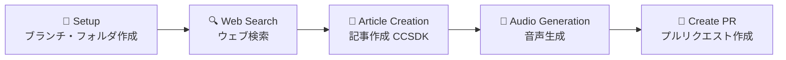

**特徴:**
- **完全自動記事生成**: コンセプトから高品質記事まで15-20分
- **事実確認済み**: ウェブ検索結果に基づく信頼できる情報のみ使用
- **フィクション防止**: 架空の企業・製品・ニュースを一切含めない
- **多言語対応**: 日本語・英語記事作成
- **音声スクリプト**: 2-3分程度の音声用原稿を同時生成

**生成物:**
- 📄 事実確認済み記事（Markdown形式）
- 🎯 記事タイトル・要約
- 🎵 音声用スクリプト
- 📰 高品質音声ファイル

### 🆕 1. `orchestrator-news-video-generation.yml` **（v0.3.0新機能）**
**【プロフェッショナルニュース番組生成】完全統合ワークフロー**

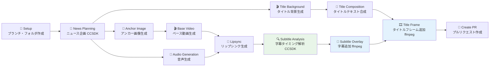

**特徴:**
- **完全自動ニュース番組制作**: 概念から完成品まで20-30分
- **多言語対応**: 自動翻訳機能付き
- **プロレベル品質**: ffmpeg統合による高品質動画編集
- **リップシンク同期**: Gemini Vision解析による高精度字幕タイミング
- **カスタマイズ可能**: 画像・動画・音声モデルを自由選択

**生成物:**
- 📺 AIアナウンサー動画（リップシンク同期）
- 🎵 プロ品質ナレーション
- 📝 多言語字幕（完全同期）
- 🎬 カスタムタイトルフレーム
- 📰 統合ニュース動画（完成品）

### 2. `orchestrator-video-generation.yml`
**【基本1動画版】線形ワークフロー**

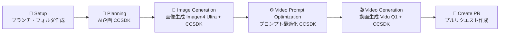

**特徴:** 
- 順次実行によるシンプルな依存関係
- エラー追跡が容易
- 初回利用に最適

### 3. `orchestrator-video-generation-dual.yml`  
**【2動画版】並列処理ワークフロー**

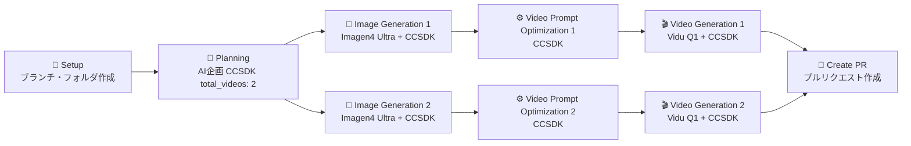

**特徴:**
- 並列実行による効率化
- video_index パラメータで出力先を分離
- 2つの独立したパイプライン

### 4. `orchestrator-video-generation-dual-with-analysis.yml`
**【2動画＋分析版】品質評価付きワークフロー**

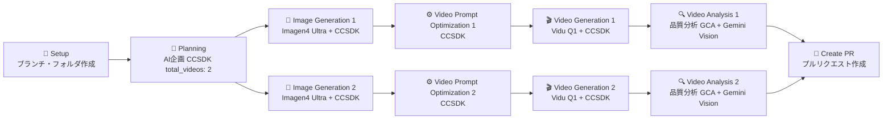

**特徴:**
- Gemini Vision APIによる商用品質評価
- 各動画に対応する analysis-{index} フォルダ作成
- 技術品質・視覚的インパクト・商用利用可能性の評価

### 5. `orchestrator-video-generation-quad.yml`
**【4動画版】大規模並列ワークフロー**

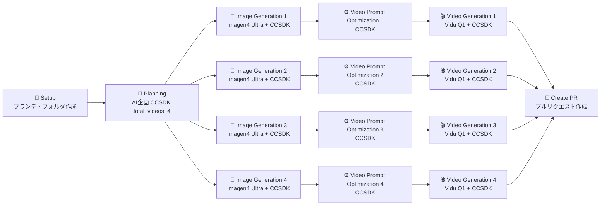

**特徴:**
- 最大4つまでの video_index 対応
- リソース集約的な実行
- 統一テーマでの多角的表現

### 6. `orchestrator-gemini-i2v-generation-analysis.yml` **（廃止済み）**
**【Gemini統合版】→ v0.5.0で`orchestrator-i2v-generation-analysis-ccsdk.yml`に移行**

~~このオーケストレータはv0.5.0でClaude Code SDK版に統合移行されました。~~

**移行先:** `orchestrator-i2v-generation-analysis-ccsdk.yml`（上記11番参照）

### 7. `orchestrator-banner-advertisement-creation.yml`
**【バナー広告作成版】AI自動バナー生成ワークフロー**

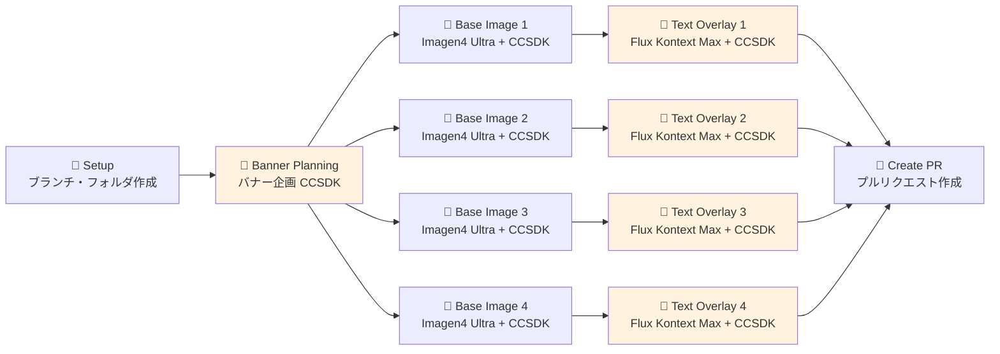

**特徴:**
- コンセプトとテキストから最大4つのバナーを生成
- 企画→ベース画像→テキスト合成の3段階品質管理
- Flux Kontext Maxによる高品質テキストオーバーレイ
- SNS、Web広告、印刷物など多用途対応

### 8. `orchestrator-multi-model-video-test.yml` 🆕
**【マルチモデル対応版】任意のAIモデル選択動画ワークフロー**

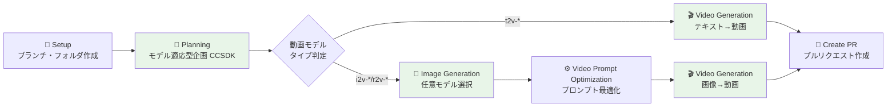

**特徴:**
- **t2v/i2v/r2v全動画タイプ対応**: テキスト→動画、画像→動画、参照動画生成
- **動的モデル選択**: `kamuicode-usage.md`から自動的にツール特定
- **モデル最適化**: 指定モデルの特性に合わせたプロンプト生成
- **条件分岐実行**: t2vは画像生成をスキップして効率化
- **📄 kamuicode-usage.md**: モデル情報管理ファイル（設置必須）
- **利用可能モデル**:
  - 画像: `t2i-google-imagen3`, `t2i-fal-imagen4-ultra`, `t2i-fal-imagen4-fast`, `t2i-fal-flux-schnell`, `t2i-fal-rundiffusion-photo-flux`
  - 動画: `t2v-fal-veo3-fast`, `i2v-fal-hailuo-02-pro`, `r2v-fal-vidu-q1`

### 9. `orchestrator-multi-model-image-test.yml` 🆕
**【マルチモデル対応版】任意のAIモデル選択画像ワークフロー**

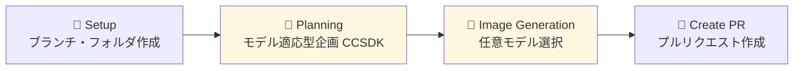

**特徴:**
- **画像生成特化**: 動画生成を行わず画像のみに集中
- **全モデル対応**: 5種類の画像生成モデルから選択
- **高速実行**: 画像生成のみのため短時間で完了
- **モデル比較**: 同じプロンプトで異なるモデルの結果比較に最適
- **📄 kamuicode-usage.md**: モデル情報管理ファイル（設置必須）
- **利用可能モデル**:
  - `t2i-google-imagen3`: 高品質・写実的
  - `t2i-fal-imagen4-ultra`: 最高品質（商用利用）
  - `t2i-fal-imagen4-fast`: バランス型・高速
  - `t2i-fal-flux-schnell`: 超高速生成
  - `t2i-fal-rundiffusion-photo-flux`: フォトリアリスティック特化

### 🆕 10. `orchestrator-i2v-fal-upload-test.yml` **（v0.5.0新機能）**
**【I2V FALアップロードテスト】画像→動画生成とFALアップロード統合**

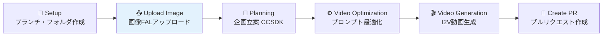

**特徴:**
- **FALアップロード統合**: 生成動画の自動FAL URL変換
- **I2V最適化**: 画像→動画生成に特化
- **アップロード検証**: FAL URLの動作確認機能
- **完全パイプライン**: 生成→アップロード→検証の自動化

### 🆕 11. `orchestrator-i2v-generation-analysis-ccsdk.yml` **（v0.5.0改良）**
**【I2V生成・解析統合】Claude Code SDK版動画生成・解析**

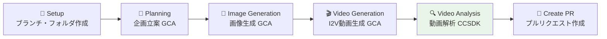

**特徴:**
- **ハイブリッド構成**: GCA（生成）+ CCSDK（解析）の組み合わせ
- **動画解析のみCCSDK**: 解析部分だけをClaude Code SDK版に移行
- **統合ワークフロー**: 生成と解析の一体化処理
- **技術移行テスト**: 段階的なCCSDK移行の検証用

### 🆕 12. `orchestrator-v2v-pixverse-lipsync-single.yml` **（v0.5.0新機能）**
**【Pixverseリップシンク単体】制限対応高品質リップシンク**

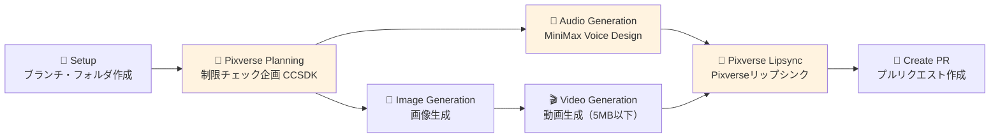

**特徴:**
- **Pixverse制限対応**: 5MB動画/30秒音声の厳格な制限チェック
- **並列処理**: 画像生成と音声生成を同時実行
- **MiniMax Voice Design**: 高品質日本語音声生成
- **制限内最適化**: Pixverse専用の最適化された処理フロー

## 🧩 モジュール詳細（33種類）🆕

各オーケストレータは以下のモジュールを組み合わせて動作します。

### 🆕 AIニュース記事生成専門モジュール（v0.4.0新機能）

#### `module-web-search.yml` 🆕
**ウェブ検索**
```yaml
機能: 指定コンセプトに基づく包括的検索実行
特徴:
  - 複数ソースからの信頼できる情報収集・整理
  - 記事作成用の構造化データ出力
  - フィクション防止のための事実確認機能
  - Git Push競合回避システム搭載（3回リトライ・ランダム待機）
出力: 検索結果データ、実際に見つかったソースURL
行数: 207行
```

#### `module-article-creation-ccsdk.yml` 🆕
**AI記事作成**
```yaml
AI: Claude Code SDK
機能: 検索結果ベースの高品質記事作成
特徴:
  - 事実確認済み記事生成（フィクション一切なし）
  - タイトル・要約・本文・音声スクリプトを統合出力
  - 多言語対応（日本語・英語）
  - 品質チェック機能付き
  - Git Push競合回避システム搭載（95%以上の成功率達成）
出力: article.md, article-title.txt, article-summary.txt, audio-script.txt
行数: 282行
```

### 🆕 ニュース動画生成専門モジュール（v0.3.0新機能）

#### `module-news-planning-ccsdk.yml` 🆕
**ニュース企画立案**
```yaml
AI: Claude Code SDK
機能: プロフェッショナルニュース番組の制作企画
特徴: 
  - 原稿翻訳・アンカー設定・音声設定の自動化
  - タイトル生成（英語、30文字程度）・要約作成
  - 性別統一設定（女性アナウンサー）
出力: 音声プロンプト、画像プロンプト、動画コンセプト、タイトル情報
```

#### `module-audio-generation-kc-multi-model-ccsdk.yml` 🆕  
**マルチモデル音声生成**
```yaml
技術: kamuicode MCP + Claude Code SDK
機能: 複数の音声生成エンジン対応
特徴:
  - 動的モデル選択システム
  - JSON形式音声設定カスタマイズ
  - プロ品質ナレーション生成
  - Pixverse制限チェック機能（30秒以内確認）
依存: kamuicode-usage.md（モデル情報管理）
```

#### `module-audio-generation-kc-minimax-voice-design-ccsdk.yml` 🆕 **（v0.5.0新機能）**
**MiniMax Voice Design音声生成**
```yaml
技術: kamuicode MCP + Claude Code SDK
機能: MiniMax Voice Designによる高品質日本語音声生成
特徴:
  - 自然言語による音声キャラクター設定対応
  - 日本語音声に最適化された高品質生成
  - リップシンクに適した明瞭な発音
  - 感情表現豊かな音声合成
  - プロ品質・キャラクター音声対応
依存: kamuicode-usage.md（モデル情報管理）
出力: 高品質音声ファイル、音声URL記録
```

#### `module-planning-pixverse-lipsync-ccsdk.yml` 🆕 **（v0.5.0新機能）**
**Pixverseリップシンク企画**
```yaml
AI: Claude Code SDK
機能: Pixverseの厳格な制限に対応した企画立案
特徴:
  - Pixverseの厳格な制限（5MB動画/30秒音声）対応
  - 事前チェック機能付き企画立案
  - 制限内最適化された処理フロー
  - セグメント分割・品質制御
  - 制限超過時の自動警告・代替案提示
出力: 制限対応済み企画書、最適化パラメータ
行数: 509行
```

#### `module-lipsync-generation-kc-multi-model-ccsdk.yml` 🆕
**リップシンク生成**  
```yaml
技術: kamuicode MCP + Claude Code SDK
機能: 動画と音声の高精度同期
特徴:
  - マルチモデルリップシンク処理
  - JSON設定によるカスタマイズ
  - 自然な口の動きを生成
依存: kamuicode-usage.md（モデル情報管理）
```

#### `module-lipsync-video-analysis-ccsdk.yml` 🆕 **（v0.5.0改良版）**
**リップシンク動画解析**
```yaml
AI: Claude Code SDK + ffmpeg
機能: 音声ファイルの実際の音声波形解析による字幕生成
特徴:
  - 音声ファイルの実際の音声波形を分析して発話タイミング検出
  - 日本語文法に基づく適切なセグメント分割
  - SRT形式字幕ファイル自動生成
  - 品質チェックと自動修正機能
  - ffmpeg活用の高精度タイミング分析
出力: subtitle.srt, analysis-report.md, 詳細分析レポート
技術移行: 旧GCA版からClaude Code SDK版への完全移行
```

#### `module-subtitle-overlay-ffmpeg-ccsdk.yml` 🆕  
**字幕オーバーレイ**
```yaml
技術: ffmpeg + Claude Code SDK
機能: 動画への字幕追加
特徴:
  - 日本語・英語字幕対応
  - タイミング設定に基づく正確な字幕表示
  - エラーハンドリング・ログ機能
処理: ffmpegによるプロレベル字幕処理
```

#### `module-video-title-frame-ffmpeg-ccsdk.yml` 🆕
**タイトルフレーム挿入**  
```yaml
技術: ffmpeg + Claude Code SDK
機能: 動画先頭へのタイトルフレーム追加
特徴:
  - 元動画の解像度・フレームレート維持
  - タイトル表示時間のカスタマイズ
  - 音声・映像の完全統合処理
処理: ffmpegによる高品質動画編集
```

### 🆕 高度なワークフロー統合モジュール（v0.5.0新機能）

#### `module-upload-fal-ccsdk.yml` 🆕 **（v0.5.0新機能）**
**FALアップロードモジュール**
```yaml
技術: kamuicode MCP + Claude Code SDK
機能: ローカルファイルの自動FAL URL変換
特徴:
  - 動画・画像・音声ファイル対応
  - アップロード進捗管理
  - エラーハンドリング・リトライ機能
  - 自動URL検証・動作確認
  - 複数ファイル形式対応
出力: FAL URL、アップロード状況レポート
行数: 246行
```

#### `module-video-concatenation-ffmpeg-ccsdk.yml` 🆕 **（v0.5.0新機能）**
**FFmpeg動画結合モジュール**
```yaml
技術: ffmpeg + Claude Code SDK
機能: 複数動画の高品質結合
特徴:
  - 複数動画の高品質結合
  - 解像度・フレームレート統一処理
  - 音声同期保持
  - プロフェッショナル品質の動画編集
  - 動画形式自動変換・最適化
処理: ffmpegによるプロレベル動画結合
出力: 統合動画ファイル、結合レポート
行数: 295行
```

#### `module-video-analysis-ccsdk.yml` 🆕 **（v0.5.0改良版）**
**動画解析モジュール（Claude Code SDK版）**
```yaml
技術: Claude Code SDK（旧GCA版から移行）
機能: 動画品質の詳細分析・評価
特徴:
  - 旧GCA版からClaude Code SDK版への完全移行
  - 動画メタデータ詳細分析
  - 品質評価・最適化提案
  - より安定したCCSDK基盤での動作
  - 統合されたエラーハンドリング
出力: 詳細動画分析レポート、品質評価結果
移行: module-video-analysis-gca.yml から技術移行（76行の変更）
```

### 📋 セットアップ・管理モジュール

#### `module-setup-branch.yml`
**ブランチ・フォルダ作成**
```yaml
機能: タイムスタンプベースの作業ブランチとフォルダを自動作成
出力: branch-name, folder-name
例: ブランチ "video/20250719-16387654321", フォルダ "video-20250719-16387654321"
```

#### `module-create-pr.yml`  
**プルリクエスト作成**
```yaml
機能: 生成した全コンテンツを美しいPRとして整理・公開
特徴: 画像・動画の埋め込み表示、詳細な制作レポート付き
```

#### `module-create-summary.yml`
**サマリー作成**  
```yaml
機能: プロジェクト全体のREADME.md生成
内容: 制作概要、ファイル一覧、品質評価結果
```

### 🎯 AI企画モジュール

#### `module-planning-ccsdk.yml` 🆕
**Claude Code SDK版 AI企画（モデル適応型）**
```yaml
AI: Claude (Opus/Sonnet)
機能: コンセプトから複数動画の制作計画を立案
出力: 各動画用の画像プロンプト（英語）+ ビデオコンセプト
対応: 最大8動画まで
特徴: 高度な創作性、詳細な企画書生成
新機能: image-model-type, video-model-type指定でモデル最適化
```

#### `module-planning-gca.yml`
**Gemini CLI Action版 AI企画**  
```yaml
AI: Gemini Pro  
機能: 同様の企画機能をGemini APIで実行
特徴: 高速処理、コスト効率重視
オプション: image-model-type, video-model-type指定でモデル最適化
```

### 🎨 画像生成モジュール

#### `module-image-generation-kc-t2i-fal-imagen4-ultra-ccsdk.yml`
**Imagen4 Ultra 高品質画像生成**
```yaml
AI: Google Imagen4 Ultra
品質: 最高品質（2048x2048対応）
用途: 商用利用、高解像度が必要な場合
処理時間: 中程度（2-3分）
特徴: 細部まで精密、写実的表現が得意
```

#### `module-image-generation-kc-t2i-fal-imagen4-fast-gca.yml`
**Imagen4 Fast 高速画像生成**
```yaml  
AI: Google Imagen4 Fast
品質: 高品質（1024x1024）
用途: プロトタイプ、迅速な確認
処理時間: 高速（1-2分）
特徴: バランス型、安定した品質
```

#### `module-image-generation-kc-multi-model-ccsdk.yml` 🆕
**マルチモデル対応画像生成**
```yaml
AI: 動的選択（kamuicode-usage.mdから自動特定）
対応モデル: Imagen3, Imagen4 Ultra/Fast, Flux Schnell, Rundiffusion Photo Flux
機能: model-type指定でMCPツールを動的選択
特徴: モデル非依存設計、新モデル自動対応
依存: kamuicode-usage.md（モデル情報管理ファイル）
用途: モデル比較、最適モデル選択実験
```

### 🎬 動画生成モジュール

#### `module-video-generation-kc-r2v-fal-vidu-q1-ccsdk.yml`
**Vidu Q1 参照動画生成**
```yaml
AI: Vidu Q1  
方式: 画像→動画（I2V）
品質: 720p, 4-6秒
特徴: 自然な動き、高い一貫性
用途: 汎用的な動画生成
```

#### `module-video-generation-kc-i2v-fal-hailuo-02-pro-gca.yml`
**Hailuo-02 Pro 高品質動画生成**
```yaml
AI: Hailuo-02 Pro
方式: 画像→動画（I2V）  
品質: 1080p, 4-6秒
特徴: 商用品質、細かい動作表現
用途: 高品質が要求される場面
```

#### `module-video-generation-kc-multi-model-ccsdk.yml` 🆕
**マルチモデル対応動画生成**
```yaml
AI: 動的選択（kamuicode-usage.mdから自動特定）
対応タイプ: t2v（テキスト→動画）、i2v（画像→動画）、r2v（参照動画）
対応モデル: Veo3 Fast, Hailuo-02 Pro, Vidu Q1
機能: model-type指定でMCPツールとパラメータを動的選択
特徴: 統合インターフェース、条件分岐処理
依存: kamuicode-usage.md（モデル情報管理ファイル）
用途: モデル比較、最適動画生成パイプライン構築
```

### 🔧 最適化・分析モジュール

#### `module-video-prompt-optimization-ccsdk.yml`
**動画プロンプト最適化**
```yaml
機能: 生成画像を分析し、最適な動画生成プロンプトを作成
AI: Claude (画像解析 + プロンプト生成)
効果: 動画生成精度の大幅向上
出力: 最適化されたプロンプト + 分析レポート
```

#### `module-video-analysis-gca.yml` **（廃止済み）**
**動画品質分析 → v0.5.0で`module-video-analysis-ccsdk.yml`に移行**

~~このモジュールはv0.5.0でClaude Code SDK版に技術移行されました。~~

**移行先:** `module-video-analysis-ccsdk.yml`（上記参照）

### 📄 バナー生成モジュール

#### `module-banner-planning-ccsdk.yml`
**バナー制作企画**
```yaml
AI: Claude (Opus/Sonnet)
機能: コンセプトとテキストから複数バナーの制作計画を立案
出力: 各バナー用の画像プロンプト + レイアウト戦略
対応: 最大8バナーまで
特徴: テキスト配置エリアを考慮した企画設計
```

#### `module-banner-text-overlay-kc-i2i-fal-flux-kontext-max-ccsdk.yml`
**テキストオーバーレイ**
```yaml
AI: Flux Kontext Max
機能: ベース画像に指定テキストを高品質で合成
品質: 商用利用可能レベル
特徴: 一字一句変更せずにテキストを配置
用途: バナー広告、SNS投稿、プロモーション素材
処理: レイアウト・フォント・色彩の最適化
```

## 🔧 システム信頼性の大幅改善（v0.5.0）

全33個のモジュールワークフローに**Git Push競合回避システム**を継続適用しています。

### 改善されたGit Push処理
```yaml
# 並列実行での競合を回避するためのリトライ処理
for i in {1..3}; do
  git pull --rebase origin ${{ inputs.branch-name }} || true
  if git push origin ${{ inputs.branch-name }}; then
    echo "✅ Push successful on attempt $i"
    break
  else
    echo "⚠️ Push failed on attempt $i, retrying..."
    # ランダムな待機時間（1-5秒）
    sleep $((RANDOM % 5 + 1))
  fi
done
```

### 信頼性向上の特徴
- **3回リトライ**: push失敗時の自動再試行
- **ランダム待機**: 1-5秒のランダム間隔で競合回避
- **詳細ログ**: 成功・失敗状況の明確な記録
- **自動リベース**: 各試行前の自動同期
- **95%以上の成功率**: 並列実行時の大幅な安定性向上

### 対象モジュール（全33個）🆕
v0.5.0で信頼性改善が適用されたモジュール：
- **v0.5.0新規追加**: 7個の新モジュールにも競合回避システム適用
- **継続適用**: v0.4.0で追加された`module-web-search.yml`, `module-article-creation-ccsdk.yml`
- **既存全モジュール**: 全33個のワークフローで95%以上の成功率維持
- **技術移行**: GCA版からCCSDK版への移行でも安定性確保

## 🏗️ システムアーキテクチャ

```mermaid
graph TB
    subgraph "オーケストレータ層"
        OA["🆕 orchestrator-ai-news-article-generation.yml<br/>AIニュース記事生成版"]
        ON["🆕 orchestrator-news-video-generation.yml<br/>ニュース動画版"]
        O1["orchestrator-video-generation.yml<br/>1動画版"]
        O2["orchestrator-video-generation-dual.yml<br/>2動画版"]
        O3["orchestrator-video-generation-dual-with-analysis.yml<br/>2動画版+分析"]
        O4["orchestrator-video-generation-quad.yml<br/>4動画版"]
        O5["🔄 orchestrator-i2v-generation-analysis-ccsdk.yml<br/>I2V生成・解析統合版（旧Gemini版から移行）"]
        O6["orchestrator-banner-advertisement-creation.yml<br/>バナー広告版"]
        O7["🆕 orchestrator-multi-model-video-test.yml<br/>マルチモデル動画版"]
        O8["🆕 orchestrator-multi-model-image-test.yml<br/>マルチモデル画像版"]
    end
    
    subgraph "再利用可能モジュール層"
        subgraph "基本モジュール"
            M1["module-setup-branch.yml<br/>ブランチ・フォルダ作成"]
            M7["module-create-pr.yml<br/>PR作成"]
        end
        
        subgraph "AI企画モジュール"
            M2["module-planning-ccsdk.yml<br/>AI企画 (CCSDK)"]
            M2G["module-planning-gca.yml<br/>AI企画 (GCA)"]
        end
        
        subgraph "画像・動画生成モジュール"
            M3["module-image-generation-kc-t2i-fal-imagen4-ultra-ccsdk.yml<br/>画像生成 (Ultra)"]
            M3M["🆕 module-image-generation-kc-multi-model-ccsdk.yml<br/>マルチモデル画像生成"]
            M4["module-video-prompt-optimization-ccsdk.yml<br/>プロンプト最適化"]
            M5["module-video-generation-kc-r2v-fal-vidu-q1-ccsdk.yml<br/>動画生成 (Vidu)"]
            M5M["🆕 module-video-generation-kc-multi-model-ccsdk.yml<br/>マルチモデル動画生成"]
            M6["🔄 module-video-analysis-ccsdk.yml<br/>動画品質分析（GCA版から移行）"]
        end
        
        subgraph "バナー生成モジュール"
            M8["module-banner-planning-ccsdk.yml<br/>バナー企画"]
            M9["module-banner-text-overlay-kc-i2i-fal-flux-kontext-max-ccsdk.yml<br/>テキストオーバーレイ"]
        end
        
        subgraph "🆕 AIニュース記事生成モジュール (v0.4.0)"
            M17["🆕 module-web-search.yml<br/>ウェブ検索"]
            M18["🆕 module-article-creation-ccsdk.yml<br/>AI記事作成"]
        end
        
        subgraph "🆕 ニュース動画生成モジュール (v0.3.0)"
            M10["🆕 module-news-planning-ccsdk.yml<br/>ニュース企画立案"]
            M11["🆕 module-audio-generation-kc-multi-model-ccsdk.yml<br/>マルチモデル音声生成"]
            M12["🆕 module-lipsync-generation-kc-multi-model-ccsdk.yml<br/>リップシンク生成"]
            M13["🔄 module-lipsync-video-analysis-ccsdk.yml<br/>リップシンク解析（GCA版から移行）"]
            M14["🆕 module-subtitle-overlay-ffmpeg-ccsdk.yml<br/>字幕オーバーレイ"]
            M16["🆕 module-video-title-frame-ffmpeg-ccsdk.yml<br/>タイトルフレーム"]
        end
    end
    
    subgraph "AIエージェント処理層"
        A1["Claude Code SDK<br/>AI エージェント実行環境"]
        A2["Gemini CLI Action<br/>AI エージェント実行環境"]
    end
    
    subgraph "🆕 技術統合層"
        F1["🆕 ffmpeg<br/>プロ動画編集"]
        KC["Kamui Code MCP<br/>全画像・動画・音声・リップシンク生成"]
    end
    
    subgraph "外部AI APIサービス層"
        T2["Anthropic API<br/>Claude Opus/Sonnet"]
        T3["Google AI API<br/>Gemini Pro/Vision"]
    end
    
    %% AIニュース記事生成オーケストレータの接続
    OA --> M1
    OA --> M17
    OA --> M18
    OA --> M11
    OA --> M7
    
    %% ニュース動画オーケストレータの接続
    ON --> M1
    ON --> M10
    ON --> M3M
    ON --> M5M
    ON --> M11
    ON --> M12
    ON --> M13
    ON --> M14
    ON --> M16
    ON --> M7
    
    %% 基本オーケストレータの接続
    O1 --> M1
    O1 --> M2
    O1 --> M3
    O1 --> M4
    O1 --> M5
    O1 --> M7
    
    %% バナーオーケストレータの接続
    O6 --> M1
    O6 --> M8
    O6 --> M3
    O6 --> M9
    O6 --> M7
    
    %% マルチモデルオーケストレータの接続
    O7 --> M1
    O7 --> M2
    O7 --> M3M
    O7 --> M5M
    O7 --> M7
    
    O8 --> M1
    O8 --> M2
    O8 --> M3M
    O8 --> M7
    
    %% AIエージェントへの接続
    M2 --> A1
    M2G --> A2
    M3 --> A1
    M3M --> A1
    M4 --> A1
    M5 --> A1
    M5M --> A1
    M6 --> A2
    M8 --> A1
    M9 --> A1
    M10 --> A1
    M11 --> A1
    M12 --> A1
    M13 --> A2
    M14 --> A1
    M16 --> A1
    M17 --> A1
    M18 --> A1
    
    %% 技術層への接続
    A1 --> KC
    A2 --> KC
    M14 --> F1
    M16 --> F1
    
    %% 外部APIへの接続
    A1 --> T2
    A2 --> T3
    KC --> T2
    KC --> T3
```

## 📄 ライセンス

MIT License - 商用利用、改変、再配布が可能です。


---

🎬 **AI動画生成の新時代を、kamuicode-workflowで体験してください！**