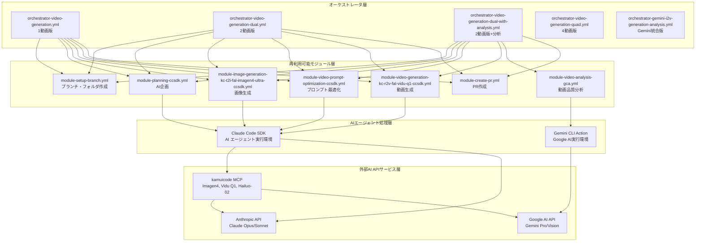

# kamuicode-workflow: AI-Powered Video Generation Workflows

🎬 **モジュール化されたAI動画生成システム** - GitHub Actionsで完全自動化された動画制作パイプライン

## 🌟 概要

kamuicode-workflowは、Kamui Codeを活用したClaude Code SDK & Gemini CLI ActionのAIエージェントによるGithub actionのクリエイティブワークフローシステムです。

**⚠️ 重要**: このシステムのモジュールは再利用可能なコンポーネントとして設計されており、品質向上と機能改善のため継続的に調整される可能性があります。最新の変更内容については、個別のモジュールファイルのコミット履歴をご確認ください。

## 🚀 クイックスタート

### 1. セットアップ
詳細なセットアップ手順は **[SETUP.md](SETUP.md)** を参照してください。

### 2. ワークフロー実行
1. GitHub リポジトリの **Actions** タブを開く
2. 使用したいオーケストレータを選択
3. **Run workflow** をクリック
4. プロンプトを入力して実行

## 🎭 オーケストレータ（5種類）

オーケストレータは複数のモジュールを組み合わせて、特定の目的に最適化されたワークフローを実行します。

### 1. `orchestrator-video-generation.yml`
**【基本1動画版】線形ワークフロー**

**含まれるジョブ:**
```yaml
- setup: ブランチ・フォルダ作成
- planning: AI企画（Claude Code SDK）
- image-generation: 画像生成（Imagen4 Ultra）
- video-prompt-optimization: プロンプト最適化
- video-generation: 動画生成（Vidu Q1）
- create-pr: プルリクエスト作成
```

**特徴:** 
- 順次実行によるシンプルな依存関係
- エラー追跡が容易
- 初回利用に最適

### 2. `orchestrator-video-generation-dual.yml`  
**【2動画版】並列処理ワークフロー**

**含まれるジョブ:**
```yaml
- setup: ブランチ・フォルダ作成
- planning: AI企画（total_videos: '2'）
- image-generation-1: 1番目の画像生成
- image-generation-2: 2番目の画像生成（並列）
- video-prompt-optimization-1: 1番目のプロンプト最適化
- video-prompt-optimization-2: 2番目のプロンプト最適化（並列）
- video-generation-1: 1番目の動画生成
- video-generation-2: 2番目の動画生成（並列）
- create-pr: プルリクエスト作成
```

**特徴:**
- 並列実行による効率化
- video_index パラメータで出力先を分離
- 2つの独立したパイプライン

### 3. `orchestrator-video-generation-dual-with-analysis.yml`
**【2動画＋分析版】品質評価付きワークフロー**

**含まれるジョブ:**
```yaml
- setup: ブランチ・フォルダ作成
- planning: AI企画（total_videos: '2'）
- image-generation-1/2: 並列画像生成
- video-prompt-optimization-1/2: 並列プロンプト最適化
- video-generation-1/2: 並列動画生成
- video-analysis-1: 1番目の動画品質分析（Gemini Vision）
- video-analysis-2: 2番目の動画品質分析（Gemini Vision）
- create-pr: プルリクエスト作成
```

**特徴:**
- Gemini Vision APIによる商用品質評価
- 各動画に対応する analysis-{index} フォルダ作成
- 技術品質・視覚的インパクト・商用利用可能性の評価

### 4. `orchestrator-video-generation-quad.yml`
**【4動画版】大規模並列ワークフロー**

**含まれるジョブ:**
```yaml
- setup: ブランチ・フォルダ作成
- planning: AI企画（total_videos: '4'）
- image-generation-1/2/3/4: 4つの並列画像生成
- video-prompt-optimization-1/2/3/4: 4つの並列プロンプト最適化
- video-generation-1/2/3/4: 4つの並列動画生成
- create-pr: プルリクエスト作成
```

**特徴:**
- 最大4つまでの video_index 対応
- リソース集約的な実行
- 統一テーマでの多角的表現

### 5. `orchestrator-gemini-i2v-generation-analysis.yml`
**【Gemini統合版】Gemini CLI Action中心ワークフロー**

**含まれるジョブ:**
```yaml
- setup: ブランチ・フォルダ作成
- planning: AI企画（Gemini CLI Action）
- image-generation: 画像生成（Imagen4 Fast + Gemini CLI Action）
- video-generation: 動画生成（Hailuo-02 Pro + Gemini CLI Action）
- video-analysis: 動画分析（Gemini Vision）
- create-pr: プルリクエスト作成
```

**特徴:**
- Claude Code SDK を使わずGemini CLI Actionで統一
- 異なるAIモデル組み合わせのテスト用
- Gemini APIキーのみで動作

## 🧩 モジュール詳細（10種類）

各オーケストレータは以下のモジュールを組み合わせて動作します。

### 📋 セットアップ・管理モジュール

#### `module-setup-branch.yml`
**ブランチ・フォルダ作成**
```yaml
機能: タイムスタンプベースの作業ブランチとフォルダを自動作成
出力: branch-name, folder-name
例: ブランチ "video/20250719-16387654321", フォルダ "video-20250719-16387654321"
```

#### `module-create-pr.yml`  
**プルリクエスト作成**
```yaml
機能: 生成した全コンテンツを美しいPRとして整理・公開
特徴: 画像・動画の埋め込み表示、詳細な制作レポート付き
```

#### `module-create-summary.yml`
**サマリー作成**  
```yaml
機能: プロジェクト全体のREADME.md生成
内容: 制作概要、ファイル一覧、品質評価結果
```

### 🎯 AI企画モジュール

#### `module-planning-ccsdk.yml` 
**Claude Code SDK版 AI企画**
```yaml
AI: Claude (Opus/Sonnet)
機能: コンセプトから複数動画の制作計画を立案
出力: 各動画用の画像プロンプト（英語）+ ビデオコンセプト
対応: 最大8動画まで
特徴: 高度な創作性、詳細な企画書生成
```

#### `module-planning-gca.yml`
**Gemini CLI Action版 AI企画**  
```yaml
AI: Gemini Pro  
機能: 同様の企画機能をGemini APIで実行
特徴: 高速処理、コスト効率重視
```

### 🎨 画像生成モジュール

#### `module-image-generation-kc-t2i-fal-imagen4-ultra-ccsdk.yml`
**Imagen4 Ultra 高品質画像生成**
```yaml
AI: Google Imagen4 Ultra
品質: 最高品質（2048x2048対応）
用途: 商用利用、高解像度が必要な場合
処理時間: 中程度（2-3分）
特徴: 細部まで精密、写実的表現が得意
```

#### `module-image-generation-kc-t2i-fal-imagen4-fast-gca.yml`
**Imagen4 Fast 高速画像生成**
```yaml  
AI: Google Imagen4 Fast
品質: 高品質（1024x1024）
用途: プロトタイプ、迅速な確認
処理時間: 高速（1-2分）
特徴: バランス型、安定した品質
```

### 🎬 動画生成モジュール

#### `module-video-generation-kc-r2v-fal-vidu-q1-ccsdk.yml`
**Vidu Q1 参照動画生成**
```yaml
AI: Vidu Q1  
方式: 画像→動画（I2V）
品質: 720p, 4-6秒
特徴: 自然な動き、高い一貫性
用途: 汎用的な動画生成
```

#### `module-video-generation-kc-i2v-fal-hailuo-02-pro-gca.yml`
**Hailuo-02 Pro 高品質動画生成**
```yaml
AI: Hailuo-02 Pro
方式: 画像→動画（I2V）  
品質: 1080p, 4-6秒
特徴: 商用品質、細かい動作表現
用途: 高品質が要求される場面
```

### 🔧 最適化・分析モジュール

#### `module-video-prompt-optimization-ccsdk.yml`
**動画プロンプト最適化**
```yaml
機能: 生成画像を分析し、最適な動画生成プロンプトを作成
AI: Claude (画像解析 + プロンプト生成)
効果: 動画生成精度の大幅向上
出力: 最適化されたプロンプト + 分析レポート
```

#### `module-video-analysis-gca.yml`
**動画品質分析**
```yaml
AI: Gemini Vision
分析観点: 商用利用での厳格な評価
評価項目:
  - 技術品質（解像度、フレームレート、色再現）
  - 視覚的インパクト（構図、ライティング、美感）  
  - コンテンツ適合性（ブランド安全性、ターゲット適合性）
  - 商用利用可能性（SNS広告、企業PR、TV CM適性）
出力: 詳細な改善提案付き評価レポート
```

## 🏗️ システムアーキテクチャ



## 📄 ライセンス

MIT License - 商用利用、改変、再配布が可能です。


## 🏷️ バージョン履歴

- **v0.0.1**: 初回リリース

---

🎬 **AI動画生成の新時代を、kamuicode-workflowで体験してください！**